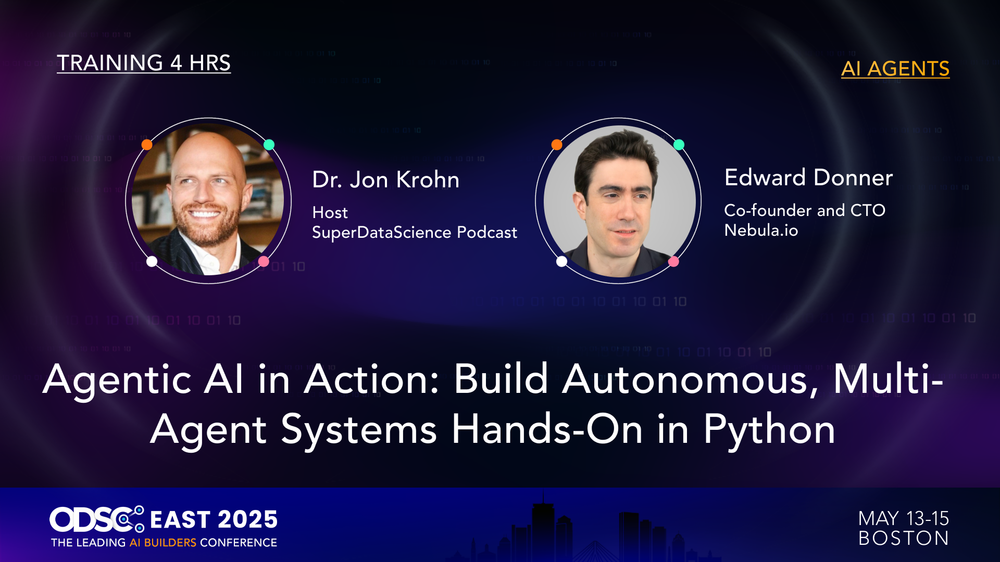

## Agentic AI in Action

## Build Autonomous, Multi-Agent Systems Hands-On in Python

_If you're looking at this in Cursor, please right click on the filename in the Explorer on the left, and select "Open preview", to view the formatted version._

This is the repo to accompany the live, hands-on workshop from Jon Krohn and Ed Donner at ODSC East in Boston.

## For much more!

If you enjoy this event, Ed has a comprehensive, immersive 6 week course on Udemy that covers this material, along with LangGraph, AutoGen and tons more. Here it is, with a coupon for ODSC people! [The Complete Agentic AI Engineering Course](https://www.udemy.com/course/the-complete-agentic-ai-engineering-course/?couponCode=AGENTIC_AI)

### Setup instructions

We are using the fantastic uv platform and setup should be relatively painless!

- Windows people, your instructions are [here](setup/SETUP-PC.md)
- Mac people, yours are [here](setup/SETUP-mac.md)
- Linux people, yours are [here](setup/SETUP-linux.md)

Any problems, please do contact Ed - I'm at ed@edwarddonner.com or on LinkedIn at https://www.linkedin.com/in/eddonner/

### Super useful resources

- The [troubleshooting](setup/troubleshooting.ipynb) notebook

### API costs - please read me!

This workshop does involve making calls to OpenAI and other frontier models, requiring an API key and a small spend, which we set up in the SETUP instructions. If you'd prefer not to spend on API calls, there are cheaper alternatives like DeepSeek and free alternatives like using Ollama!

Details are [here](guides/09_ai_apis_and_ollama.ipynb).

Be sure to monitor your API costs to ensure you are totally happy with any spend. For OpenAI, the dashboard is [here](https://platform.openai.com/usage).

### ABOVE ALL ELSE -

Be sure to have fun with the workshop! You could not have picked a better time to be learning about Agentic AI. I hope you enjoy every single minute! And if you get stuck at any point - [contact us](https://www.linkedin.com/in/eddonner/).